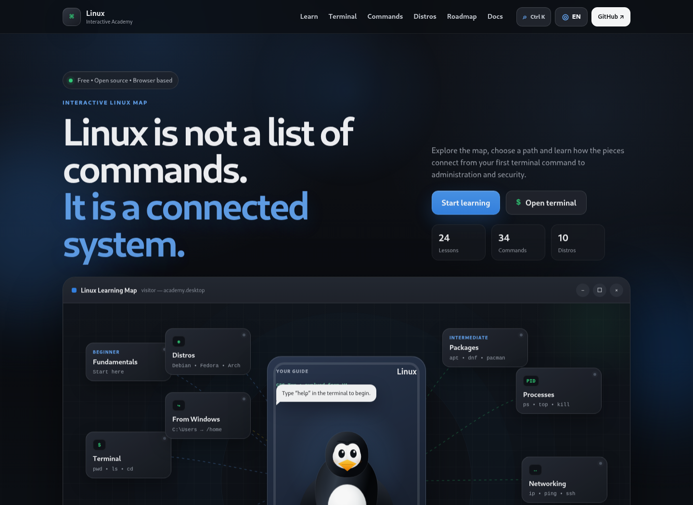
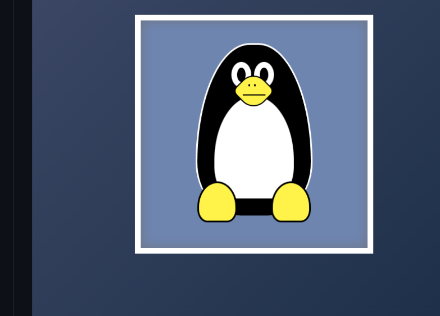

# Linux Drawing — V4 Interactive Linux Academy

Linux Drawing started as a small HTML/CSS experiment: a Tux-inspired penguin drawn with simple shapes. V4 keeps that origin visible, but turns the project into a responsive Linux learning environment for GitHub Pages.



## What changed from V1



The original project focused on a static CSS drawing. V4 keeps the recognizable black oval body, white belly, yellow beak and feet, then adds a more dimensional CSS illustration, cursor-following eyes, natural blinking, idle motion, click reactions and a one-eye wink after the visitor stays over Tux for a moment.

The page itself became an interactive academy rather than a static illustration.

## Main features

- Interactive mind-map hero connecting Linux topics from beginner to advanced.
- Clickable learning nodes for fundamentals, terminal, filesystem, permissions, packages, processes, networking, Bash, administration, security, distributions and Windows migration.
- Safe browser terminal with an in-memory virtual filesystem.
- Terminal practice for navigation, files, search, pipes, redirection, package-manager examples, process inspection, networking, systemd-style commands and more.
- `man <command>` learning summaries inside the simulator.
- 24 bilingual lessons: Beginner, Intermediate and Advanced.
- EN / PT-BR interface switch with persistent preference when browser storage is available.
- Linux commands and their syntax remain unchanged when the explanatory UI is translated.
- Command Explorer with syntax, examples, risk warnings and official documentation links.
- Distribution carousel for Debian, Ubuntu, Fedora, Pop!_OS, Arch Linux, Linux Mint, openSUSE, Kali Linux, EndeavourOS and NixOS.
- GNOME-style distribution modal with profile, use cases and official website.
- Interactive filesystem, permissions and package-manager references.
- Search palette with `Ctrl/Cmd + K`.
- Local progress, quiz and terminal missions.
- Responsive burger navigation and touch-friendly distro carousel.
- Reduced-motion support and keyboard-accessible controls.

## Documentation basis

The learning content was rewritten around primary or official references instead of generic Linux copy. The site links directly to these sources where relevant:

- [GNU Coreutils Manual](https://www.gnu.org/software/coreutils/manual/coreutils.html)
- [GNU Bash Reference Manual](https://www.gnu.org/software/bash/manual/bash.html)
- [Linux man-pages](https://man7.org/linux/man-pages/)
- [Filesystem Hierarchy Standard 3.0](https://refspecs.linuxfoundation.org/FHS_3.0/fhs/index.html)
- [Debian Reference](https://www.debian.org/doc/manuals/debian-reference/)
- [Arch Linux pacman manual](https://man.archlinux.org/man/pacman.8)
- [Fedora Documentation](https://docs.fedoraproject.org/)
- [Kali Linux Documentation](https://www.kali.org/docs/)

The academy is an educational overview, not a replacement for the documentation shipped by a user's own distribution.

## Safe terminal design

The terminal is a JavaScript simulation. It does **not**:

- open a real shell;
- execute host commands;
- use `eval()`;
- access the visitor's real filesystem;
- make package changes;
- connect to SSH hosts;
- run arbitrary scripts.

Commands such as `rm`, `sudo apt update`, `systemctl`, `ssh` and `kill` are simulated inside the browser. The virtual filesystem can be reset at any time with `reset`.

Try:

```bash
help
pwd
ls -la
cd Documents
touch notes.txt
cat welcome.txt
find . -name "*.txt"
man rm
ps aux
lsblk
ip addr
systemctl status ssh
```

## Languages

The interface supports:

- English
- Português Brasileiro

Only explanatory content is translated. Real Linux command names, flags, syntax and code examples remain in their original form, for example:

```bash
sudo apt update
sudo dnf install curl
sudo pacman -S curl
chmod u+x script.sh
```

## Project structure

```text
Linux-Drawing-V4/
├── index.html
├── README.md
├── LICENSE
├── robots.txt
├── sitemap.xml
├── preview-v4-desktop.png
├── preview-v4-mobile.png
├── assets/
│   └── favicon.svg
├── css/
│   └── style.css
├── js/
│   ├── bundle.js
│   ├── app.js
│   ├── i18n.js
│   ├── tux.js
│   ├── mindmap.js
│   ├── terminal.js
│   ├── course.js
│   ├── commands.js
│   ├── distros.js
│   ├── search.js
│   ├── quiz.js
│   └── data/
│       ├── lessons.js
│       ├── commands.js
│       └── distros.js
└── tools/
    └── build_bundle.py
```

## Why there is a bundle

`index.html` loads `js/bundle.js` as a classic deferred script. This avoids the common `file://` restriction that can prevent ES-module imports from loading when someone double-clicks `index.html` locally.

The maintainable source remains split across the files inside `js/`. After editing them, rebuild the browser bundle with:

```bash
python3 tools/build_bundle.py
```

No third-party Python package is required.

## Run locally

You can open `index.html` directly. For a development workflow closer to GitHub Pages, a tiny static server is still convenient:

```bash
python3 -m http.server 8000
```

Then open:

```text
http://localhost:8000
```

## GitHub Pages

The project has no backend and no build step is required for deployment after `bundle.js` has been generated. Relative paths are used so it can be published from the `Linux-Drawing` repository through GitHub Pages.

## Performance

The interface uses HTML, CSS and Vanilla JavaScript. Tux eye tracking is throttled through `requestAnimationFrame`; decorative motion uses transforms/opacity; the mind-map connectors are redrawn only when needed; and `prefers-reduced-motion` is respected.

## Security

- No secrets or API keys.
- No analytics or trackers.
- No real command execution.
- No backend.
- User-entered terminal text is written with text nodes rather than injected as executable HTML.
- External distribution links open with `noopener noreferrer`.

## License

MIT — see [LICENSE](LICENSE).

## Author

Created by [Gustavo Vitor](https://github.com/GustavoVitorS).
