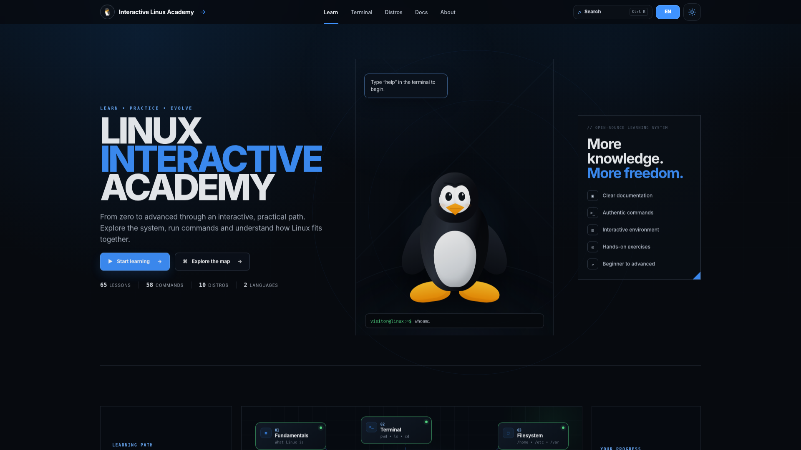
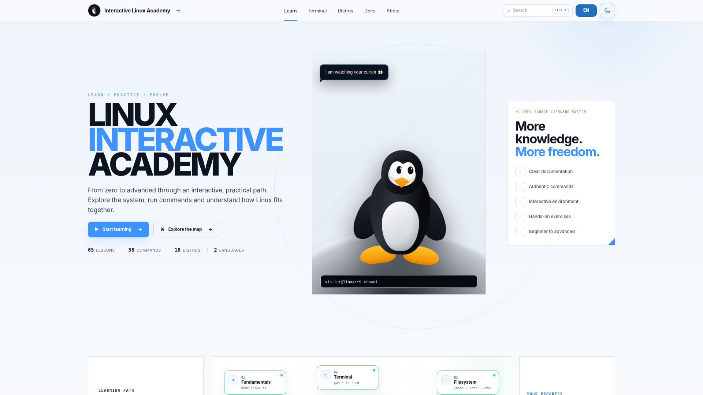
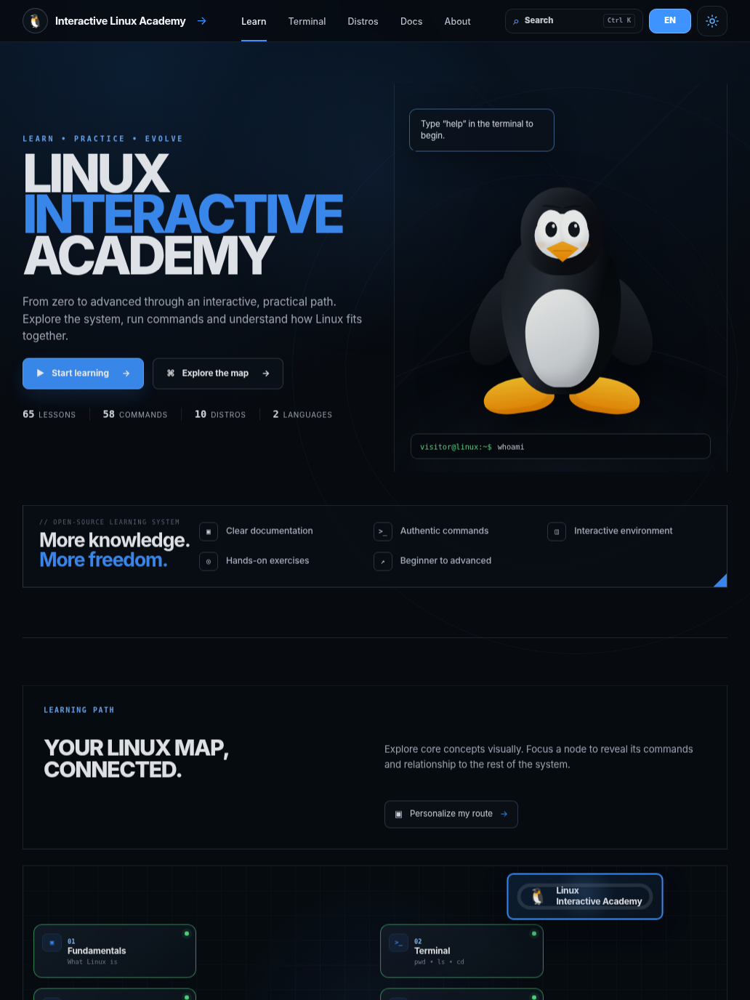
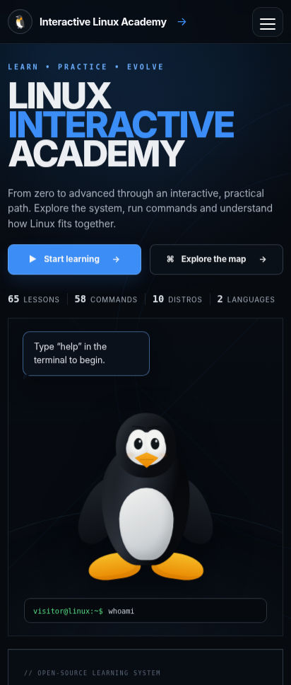

# Interactive Linux Academy V6.3 RC

> Release Candidate / Codebase Consolidation

Interactive Linux Academy is an open-source, browser-based Linux learning environment built with **HTML, CSS and Vanilla JavaScript**. It combines a visual learning map, bilingual lessons, a safe simulated terminal, quizzes, command references, distro exploration and local progress without requiring an account or backend.

V6.3 is deliberately **not a redesign**. It consolidates the V6.2.5 codebase into a release-ready architecture so the source is easier to review, test and contribute to while preserving the approved product experience.



## V6.3 RC highlights

- Consolidated legacy CSS version layers into six responsibility-based stylesheets.
- Grouped deployable CSS, JavaScript, icons and preview media under `assets/` for a cleaner repository root.
- Reorganized JavaScript into `core`, `features` and `data` modules.
- Removed production `v5.js`, `v6.js`, `v6.1.js`, `v6.2.js` layers.
- `assets/js/bundle.js` remains a generated static artifact for GitHub Pages and `file://` compatibility.
- Added `tools/validate_project.py` for structural/data/i18n/security validation.
- Added deterministic GitHub Actions validation for pushes and pull requests.
- Added `ARCHITECTURE.md`, `CONTRIBUTING.md`, `SECURITY.md`, `CODE_OF_CONDUCT.md` and issue templates.
- Added `CONTENT_AUDIT.md` covering all **65 lessons** and **58 commands**.
- Added a visible Terminal Lab disclosure explaining that the shell is simulated and cannot access the visitor's machine.
- Removed avoidable `innerHTML`/`insertAdjacentHTML` usage from maintainable JavaScript source.
- Added a Content Security Policy compatible with the current static deployment.
- Preserved the V6.2.5 Dark/Light visual identity, PT-BR/EN behavior, learning map, quizzes, terminal, references and distro tools.

## Product features

- **65 bilingual lessons** across beginner, intermediate and advanced levels.
- **58 command references** with command-specific provenance.
- **10 Linux distribution profiles** with comparison/finder tools.
- Visual **Linux learning map**.
- Safe **Terminal Lab** with a virtual filesystem.
- Command Inspector and guided terminal missions.
- Progressive knowledge tests and local statistics.
- Local achievements and continue-learning state.
- Distro explorer, distro comparator and distro finder.
- Documentation explorer and quick reference.
- PT-BR / English live switching.
- Dark / Light themes.
- Responsive layouts from small mobile widths through ultrawide desktop.
- No login, backend, analytics or paid API requirement.

## Terminal Lab: important boundary

The Terminal Lab is an educational **JavaScript simulation**. It reproduces selected command behavior against an in-memory virtual filesystem.

It does **not**:

- run a Linux kernel;
- execute a real system shell;
- access visitor files;
- perform real `sudo`, package installation or service changes;
- establish SSH connections;
- evaluate arbitrary JavaScript.

The project intentionally presents that limitation in the UI instead of implying that a real Linux system is running in the browser.

## Documentation integrity

Command references are centralized in `assets/js/data/references.js`.

Reference priority:

1. upstream project documentation;
2. official distribution documentation;
3. authoritative upstream/manual page;
4. exact manual-page rendering;
5. reputable reference when no stronger primary source exists.

Current audit:

- **58/58** commands have specific references;
- **0** generic man7 homepage fallbacks;
- **0** direct `www.gnu.org` runtime documentation links;
- source-aware labels distinguish official docs from manual pages.

See [`REFERENCE_AUDIT.md`](REFERENCE_AUDIT.md) and [`CONTENT_AUDIT.md`](CONTENT_AUDIT.md).

## Architecture

### Static assets

```text
assets/
├── css/
│   ├── tokens.css
│   ├── base.css
│   ├── layout.css
│   ├── components.css
│   ├── themes.css
│   └── responsive.css
├── js/
│   ├── core/
│   ├── features/
│   ├── data/
│   └── bundle.js       # generated
├── icons/
│   └── favicon.svg
└── images/
    └── previews/       # README / release screenshots
```

The explicit bundle order is stored in `tools/build_order.txt`.

Read [`ARCHITECTURE.md`](ARCHITECTURE.md) for the complete structure and event/storage model.

## Build

No npm install is required.

Rebuild the browser bundle:

```bash
python3 tools/build_bundle.py
```

Verify that the committed bundle matches the maintainable source:

```bash
python3 tools/build_bundle.py --check
```

## Validation

Run the complete offline validation:

```bash
python3 tools/validate_project.py
python3 tools/check_references.py --offline
python3 tools/build_bundle.py --check
node --check assets/js/bundle.js
```

The repository also runs these checks through GitHub Actions.

Current RC validation:

- 65 lessons validated structurally and for source metadata;
- 58 commands / 58 command-specific references;
- no duplicate HTML IDs;
- no missing local assets;
- no legacy version-layer JS/CSS in production;
- no `innerHTML`/`insertAdjacentHTML` in maintainable JavaScript;
- no horizontal overflow or learning-map node overlap in the tested viewport matrix;
- PT-BR/EN, Dark/Light, terminal `pwd`, global search and distinct distro comparator defaults passed smoke testing;
- zero JavaScript console/page errors in the browser QA harness.

See [`VALIDATION_REPORT.md`](VALIDATION_REPORT.md) and [`QA_REPORT.md`](QA_REPORT.md).

## Tested viewports

```text
320×568
360×800
390×844
412×968
768×1024
1032×1376
1280×800
1366×768
1440×900
1920×1080
2560×1080
```

## Screenshots

### Dark Mode


### Light Mode



### Tablet



### Mobile



## Run locally

```bash
python3 -m http.server 8000
```

Open:

```text
http://localhost:8000
```

The generated classic bundle also preserves direct static hosting compatibility.

## Contributing

Start with [`CONTRIBUTING.md`](CONTRIBUTING.md).

Dedicated issue templates are included for:

- bugs;
- Linux content/documentation errors;
- focused feature requests.

Technical content corrections should include an upstream, official or precise manual reference whenever possible.

## Security

See [`SECURITY.md`](SECURITY.md).

The application is static, does not execute a host shell and does not include runtime analytics/tracking. A CSP limits the current browser resource surface.

## Evolution

- **V1** — CSS Tux drawing.
- **V4** — interactive Linux map and browser terminal.
- **V5** — editorial product redesign and integrated learning tools.
- **V6** — Academic Edition: structured curriculum, assessments and progress.
- **V6.1** — visual consistency and theme refinements.
- **V6.2** — documentation integrity, i18n cleanup and distro/comparator fixes.
- **V6.2.1–V6.2.5** — targeted visual, documentation, toggle and attribution patches.
- **V6.3 RC** — codebase consolidation, validation, content audit, contribution workflow and release hardening.

The Git history preserves the detailed visual evolution; production code no longer carries one JavaScript/CSS layer per historical version.

## Author

**Gustavo Vitor** — [GitHub](https://github.com/GustavoVitorS)

## License

MIT. See [`LICENSE`](LICENSE).
