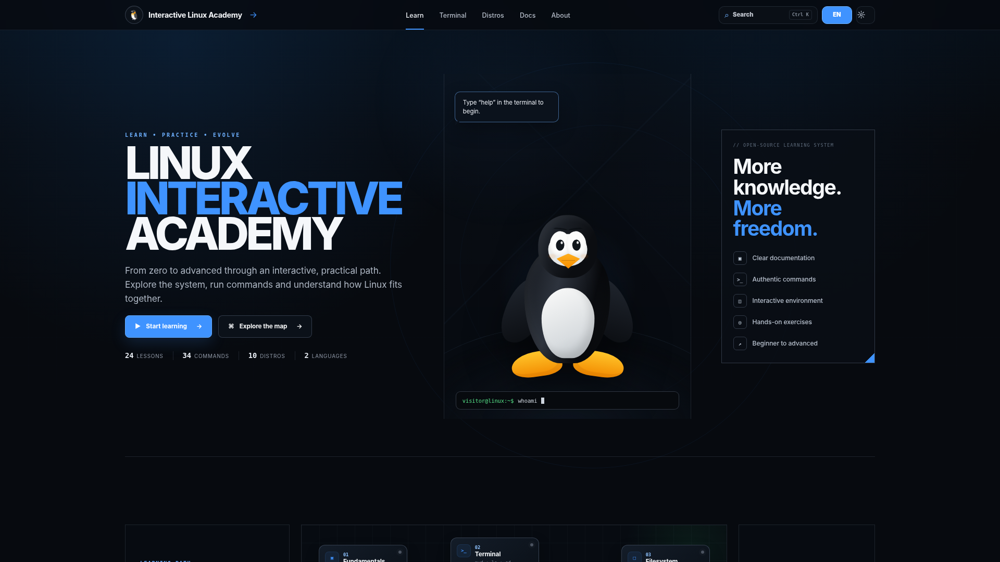
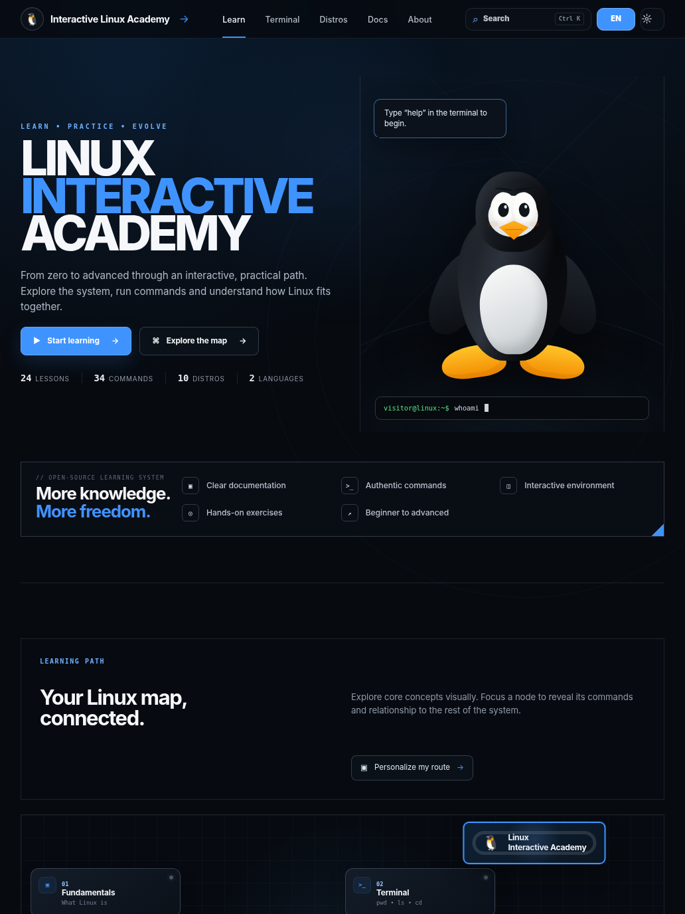
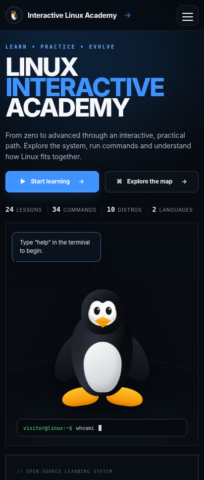

# Interactive Linux Academy V5

> Learn Linux by understanding the system, practicing real command syntax, and completing safe browser-based labs.

Interactive Linux Academy started as **Linux Drawing**, a small HTML/CSS Tux experiment. V5 turns that idea into an editorial, bilingual Linux learning product built with HTML, CSS and Vanilla JavaScript and designed to run directly on GitHub Pages.



## V1 → V4 → V5

- **V1 — Linux Drawing:** static CSS illustration of Tux.
- **V4 / V4.2:** interactive Tux, learning map, simulated terminal, lessons, command explorer, distro explorer, PT-BR/EN and responsive refinements.
- **V5 — Interactive Linux Academy:** new editorial product system, personalized routes, richer Terminal Lab, Command Inspector, terminal missions, split learning, distro comparison/finder, documentation explorer, quick reference, progress dashboard and local achievements.

The mascot remains implemented with HTML/CSS/JS instead of being replaced by a static hero image, preserving the project's original technical identity.

## Highlights

### Interactive learning map

The visual Linux map connects core concepts such as Fundamentals, Terminal, Filesystem, Distributions, Package Management, Processes, Networking, and Shell & Bash. Nodes react to focus/hover, can highlight a personalized route, and link into the learning experience.

### Terminal Lab

The terminal is a **JavaScript educational simulator**, not a real shell. It includes a virtual filesystem, command history, simulated outputs, progressive missions and lesson-to-terminal workflows.

It never executes host commands, accesses the user's filesystem, installs packages, or uses `eval()`.

### Command Inspector

Commands such as `ls -lah` can be broken down into their command and flags so learners understand what they type instead of memorizing opaque strings.

### Split Learn Mode

Open a lesson and the live browser terminal side by side on desktop. On smaller screens the experience remains usable without resetting terminal state.

### Linux curriculum

The project includes **24 bilingual lessons** across Beginner, Intermediate and Advanced levels, with real command syntax, examples, expected output, warnings, exercises and official references.

### Command Explorer + Quick Reference

Browse and search **34 Linux commands** by category, inspect examples, read safety warnings and send supported commands directly to the Terminal Lab.

### Distribution Explorer

Explore **10 distributions** including Debian, Ubuntu, Fedora, Pop!_OS, Arch Linux, Linux Mint, openSUSE, Kali Linux, EndeavourOS and NixOS.

V5 also adds:

- comparison of up to three distributions;
- a local distro finder based on experience and goals;
- detailed distro modal/drawer information;
- official website links.

### Personalized learning route

First-time onboarding can highlight a route for:

- Linux beginners;
- Windows users;
- development;
- servers / DevOps;
- cybersecurity;
- advanced Linux users.

The preference is stored locally and requires no account.

### Progress and achievements

Lesson progress, missions, route preferences and achievements use `localStorage`. There is no backend, fake account system or leaderboard.

## Design system

V5 introduces a deliberate editorial/product design language influenced by modern open-source desktop interfaces and contemporary digital-product curation:

- dark Linux-oriented surfaces;
- restrained GNOME-inspired blue;
- terminal green only for technical states;
- Tux yellow/orange as mascot identity;
- Instrument Sans-style UI typography with IBM Plex Mono-style technical typography and robust fallbacks;
- consistent spacing, border, radius, motion and surface tokens;
- reduced reliance on repetitive cards and generic SaaS patterns.

The implementation remains original to Interactive Linux Academy rather than copying a specific reference site.

## Responsive design

The layout is designed as separate responsive compositions rather than a compressed desktop page. It was checked at representative widths including:

`320`, `360`, `375`, `390`, `412`, `430`, `768`, `960`, `1032`, `1280`, `1366`, `1440`, `1920`, and ultrawide layouts.

The learning map changes from a radial network to an adaptive two-column/vertical structure before the center hub can collide with learning nodes.





## Accessibility

The interface includes:

- semantic HTML;
- keyboard-accessible navigation;
- `focus-visible` states;
- dialog semantics and Escape behavior;
- accessible touch targets;
- reduced-motion support;
- bilingual labels and controls;
- responsive terminal controls;
- contrast-conscious dark surfaces.

## Languages

The interface supports:

- English
- Português Brasileiro

Linux commands and flags are intentionally **not translated**. Examples remain authentic, such as:

```bash
ls -la
sudo apt update
dnf install package
pacman -S package
chmod 755 script.sh
grep "error" logfile.txt
systemctl status ssh
```

## Security model

Interactive Linux Academy is a static educational web application.

It does **not**:

- execute a real shell;
- access the host filesystem;
- use `eval()`;
- expose API keys;
- include advertising scripts;
- include tracking or analytics;
- require a backend.

## Project structure

```text
Interactive-Linux-Academy/
├── index.html
├── README.md
├── CHANGELOG.md
├── LICENSE
├── robots.txt
├── sitemap.xml
├── assets/
│   └── favicon.svg
├── css/
│   ├── style.css          # V4 compatibility/base layer
│   └── v5.css             # V5 product/editorial design system
├── js/
│   ├── runtime.js
│   ├── i18n.js
│   ├── tux.js
│   ├── mindmap.js
│   ├── terminal.js
│   ├── course.js
│   ├── commands.js
│   ├── distros.js
│   ├── search.js
│   ├── quiz.js
│   ├── app.js
│   ├── v5.js
│   ├── bundle.js          # generated classic bundle for GitHub Pages/local use
│   └── data/
│       ├── lessons.js
│       ├── commands.js
│       └── distros.js
└── tools/
    └── build_bundle.py
```

## Running locally

A simple static server is recommended:

```bash
python3 -m http.server 8000
```

Then open:

```text
http://localhost:8000
```

The site is also designed for GitHub Pages.

## Building `bundle.js`

The maintainable source files inside `js/` are the source of truth. Do not edit only the generated bundle.

After changing JavaScript source files, rebuild with:

```bash
python3 tools/build_bundle.py
```

Then optionally validate syntax:

```bash
node --check js/bundle.js
```

## GitHub Pages

Repository:

```text
https://github.com/GustavoVitorS/Interactive-Linux-Academy
```

Expected Pages path:

```text
https://gustavovitors.github.io/Interactive-Linux-Academy/
```

All production asset paths are relative so the project can live below the repository subpath.

## Contributing

Contributions that improve Linux accuracy, accessibility, exercises, translations, responsive behavior or documentation are welcome. Keep examples technically grounded and distinguish simulated terminal behavior from behavior on a real Linux system.

## License

MIT — see [LICENSE](LICENSE).
